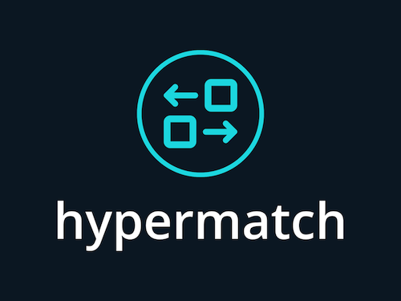
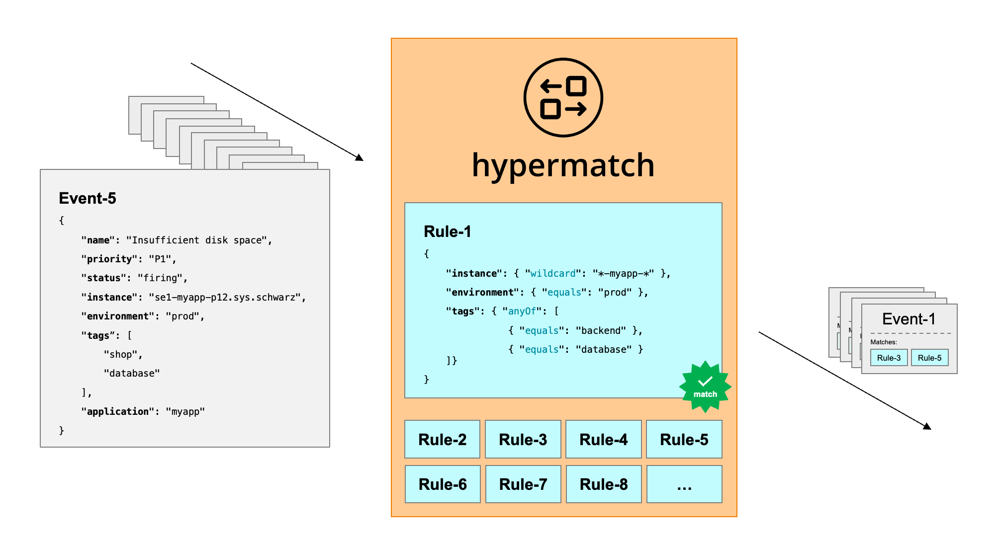

[](https://jobs.schwarz)
[](https://github.com/SchwarzIT/hypermatch/actions/workflows/go-test.yml)
[](https://coveralls.io/github/SchwarzIT/hypermatch?branch=main)
[](https://goreportcard.com/report/github.com/SchwarzIT/hypermatch)
[](https://pkg.go.dev/github.com/schwarzit/hypermatch)




# Introduction
Hypermatch is a high-performance Go library that enables rapid matching of a large number of rules against events. Designed for speed and efficiency, hypermatch handles thousands of events per second with low latency, making it ideal for real-time systems.

- **Fast Matching**: Matches events to a large set of rules in-memory with minimal delay  ... [it's really fast! (Benchmark)](_benchmark/benchmark.md)
- **Readable Rule Format**: Serialize rules into human-readable JSON objects.
- **Flexible Rule Syntax**: Supports various matching conditions, including equals, prefix, suffix, wildcard, anything-but, all-of, and any-of.

An event consists of a list of fields, provided as name/value pairs. A rule links these event fields to patterns that determine whether the event matches.



# Quick Start

```go
import (
    hypermatch "github.com/SchwarzIT/hypermatch"
)

func main() {
    //Initialize hypermatch
    hm := hypermatch.NewHyperMatch()
    
    //Add a rule
    if err := hm.AddRule("markus_rule", hypermatch.ConditionSet{
        hypermatch.Condition{Path: "firstname", Pattern: hypermatch.Pattern{Type: hypermatch.PatternEquals, Value: "markus"}},
        hypermatch.Condition{Path: "lastname", Pattern: hypermatch.Pattern{Type: hypermatch.PatternEquals, Value: "troßbach"}},
        }); err != nil {
            panic(err)
    }
    
    //Test with match
    matchedRules := hm.Match([]hypermatch.Property{
        {Path: "firstname", Values: []string{"markus"}},
        {Path: "lastname", Values: []string{"troßbach"}},
    })
    log.Printf("Following rules matches: %v", matchedRules)
    
    //Test without match
    matchedRules = hm.Match([]hypermatch.Property{
        {Path: "firstname", Values: []string{"john"}},
        {Path: "lastname", Values: []string{"doe"}},
    })
    log.Printf("Following rules matches: %v", matchedRules)
}
```

# Documentation
## Example Event

An event is represented as a JSON object with various fields. Here’s a sample event:

```javascript
{
        "name": "Too many parallel requests on system xy",
        "severity": "critical",
        "status": "firing",
        "message": "Lorem ipsum dolor sit amet, consetetur sadipscing elitr.",
        "team": "awesome-team",
        "application": "webshop",
        "component": "backend-service",
        "tags": [
            "shop",
            "backend"
        ]   
}
```

**This example will be referenced throughout the documentation.**

## Matching Basics

Rules in Hypermatch are composed of conditions defined by the `ConditionSet` type.

- **Case-Insensitive Matching**: All value comparisons are case-insensitive.
- **Supported Types**: Currently, only strings and string arrays are supported.

Each condition includes:

- **Path**: The field in the event to match against.
- **Pattern**: The pattern used to match the value at the specified path.

Here’s an example rule that matches the event above:

```go
ConditionSet{
    {
        Path: "status",
        Pattern: Pattern{Type: PatternEquals, Value: "firing"},
    },
    {
        Path: "name",
        Pattern: Pattern{Type: PatternAnythingBut, Sub: []Pattern{
                {Type: PatternWildcard, Value: "TEST*"},
            },
        },
    },
    {
        Path: "severity",
        Pattern: Pattern{ Type: PatternAnyOf,
            Sub: []Pattern{
                {Type: PatternEquals, Value: "critical"},
                {Type: PatternEquals, Value: "warning"},
            },
        },
    },
    {
        Path: "tags",
        Pattern: Pattern{ Type: PatternAllOf,
            Sub: []Pattern{
                {Type: PatternEquals, Value: "shop"},
                {Type: PatternEquals, Value: "backend"},
            },
        },
    },
}
```

The rules and conditions are also expressible as JSON objects. The following JSON is the equivalent of the above Go notation for a `ConditionSet`:

```javascript
{
    "status": {
        "equals": "firing"
    },
    "name": {
        "anythingBut": [
            {"wildcard": "TEST*"}
        ]
    },
    "severity": {
        "anyOf": [
            {"equals": "critical"},
            {"equals": "warning"}
        ]
    },
    "tags": {
        "allOf": [
            {"equals": "shop"},
            {"equals": "backend"}
        ]
    }
}
```

**Note**: For simplicity, all examples in this documentation will be presented in JSON format.

## Matching syntax
### "equals" matching
The `equals` condition checks if an attribute of the event matches a specified value, case-insensitively.

```javascript
{
    "status": {
        "equals": "firing"
    }
}
```

If the attribute value is type of:

- **String**: Checks if the value is equal to "firing"
- **String array**: Checks if the array contains an element equal to "firing"

### "prefix" matching
The `prefix` condition checks if an attribute starts with a specified prefix, case-insensitively.

```javascript
{
    "status": {
        "prefix": "fir"
    }
}
```

If the attribute value is type of:

- **String**: Checks if the value begins with "fir"
- **String array**: Checks if the array contains an element that begins with "fir"

### "suffix" matching
The `suffix` condition checks if an attribute ends with a specified suffix, case-insensitively.

```javascript
{
    "status": {
        "suffix": "ing"
    }
}
```

If the attribute value is type of:

- **String**: Checks if the value ends with "ing"
- **String array**: Checks if the array contains an element that ends with "ing"

### "wildcard" matching
The `wildcard` condition uses wildcards to match the value of an attribute, ignoring case.

- Use * as a wildcard to match any number of characters (including none).
- You cannot place wildcards directly next to each other.

```javascript
{
    "name": {
        "wildcard": "*parallel requests*"
    }
}
```

If the attribute value is type of:

- **String**: Checks if the value matches the pattern \*parallel requests\*
- **String array**: Checks if any value in the array matches the pattern

### "anythingBut" matching
The `anythingBut` condition negates the match, triggering only if the specified condition is not met.

```javascript
{
    "status": {
        "anythingBut": [
            {"equals": "firing"}
        ]
    }
}
```

If the attribute value is type of:

- **String**: Checks if the value is anything other than "firing"
- **String array**: Checks if the array does *not* contain an element equal to "firing"

### "anyOf" matching
`anyOf` does correspond to a boolean "inclusive-or". It checks multiple conditions and matches if **any** of the conditions are true.

```javascript
{
    "status": {
        "anyOf": [
            {"equals": "firing"},
            {"equals": "resolved"}
        ]
    }
}
```

If the attribute value is type of:

- **String**: Checks if the value is either "firing" or "resolved"
- **String array**: Checks if the array contains an element equal to "firing" or "resolved" or both.

### "allOf" matching
`allOf` does correspond to a boolean "and". It checks multiple conditions and matches if **all** the conditions are true.

```javascript
{
    "tags": {
        "allOf": [
            {"equals": "shop"},
            {"equals": "backend"}
        ]
    }
}
```

If the attribute value is type of:

- **String**: This condition makes no sense, as it checks if the value is equal to "shop" and "backend"
- **String array**: Checks if the array contains both "shop" and "backend"


# Performance

**hypermatch** is designed to be blazing fast with very large numbers of rules.
Nevertheless, there are a few things to consider to get maximum performance:
- Shorten the number of fields inside the rules, the fewer conditions, the shorter is the path to find them out.
- Try to make the **paths** as diverse as possible in events and rules. The more heterogeneous fields, the higher the performance.
- Reduce the number of **anyOf** conditions wherever possible
